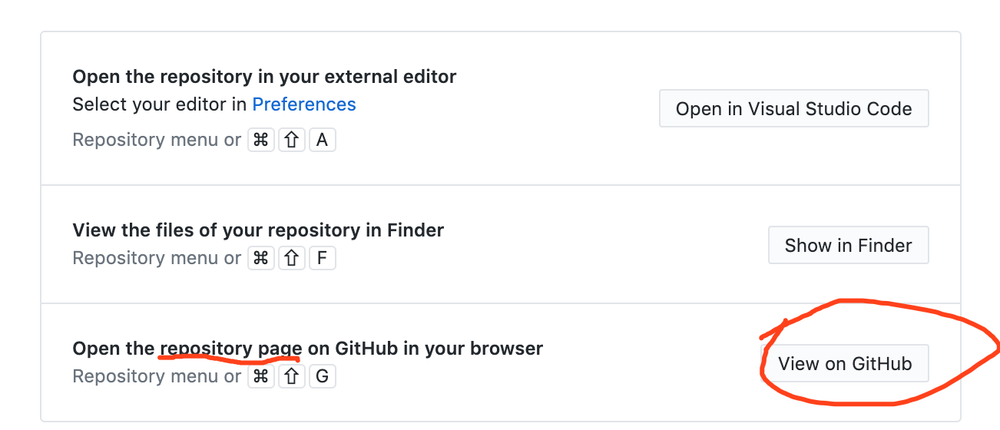
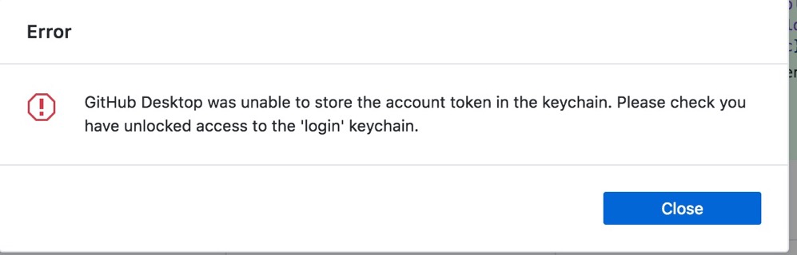
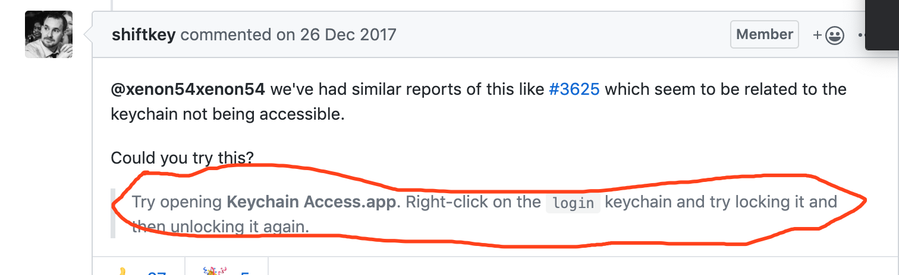
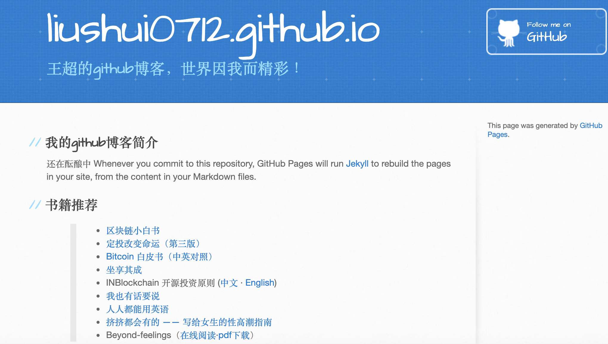
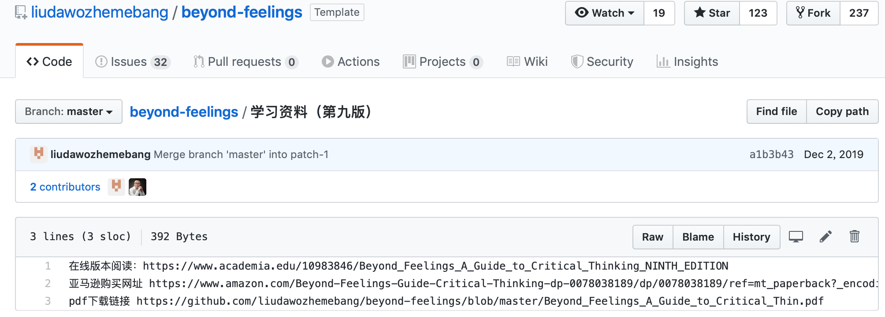

# 作为小白，要摆脱“我不行”真的很难吗？

> *  任何人在自己不熟悉的领域都是小白。 面对**不熟**的领域，我们往往用**“我不行”、“我不会”**来避免自己**“搞砸了”**的尴尬。
> * 然而，想要突破现状，改变自己，就要走出舒适圈，去尝试做一些目前并不擅长的事情。
> * 作为编程小白，最近突然想有自己的博客网站，刚开始以为路漫漫其修远，最后居然只用了两个夜晚。

## 一、缘由与目标

前几天分享了笑来老师的[**区块链小白书**](https://blockchainlittlebook.com/#/)给朋友，在文章中看到了可以制作自己的网站，就根据文中步骤一步步走了下来：买了自己的域名（wang chao.plus），在github上fork了笑来老师的repo，并在settings中设置，成功打开自己网址的一刹那相当兴奋啦！

在以上步骤的运行过程中，碰到了很多看不懂的github术语，还好有google。用了一晚上的时间，大概在第一晚凌晨3点左右明白了github的每个项目是什么意思，并意外搜索到了[如何在github上建立自己的个人博客]([https://zhuanlan.zhihu.com/p/28321740](https://zhuanlan.zhihu.com/p/28321740)
)，这下好了，因为新冠病毒而不得不宅在家里的假期里就有小目标了!

我的目标是[wangchao.plus](https://wangchao.plus/)可以汇总各种重要信息，就像笑来老师把*xiaolai.github.io*做成个人博客[https://lixiaolai.com](https://lixiaolai.com)一样，而不仅仅是**一篇文章**的展示页。

## 二、探索与方案

要完成自己的github博客，需要做的事情有好多，毕竟我现在只学会了最基本的操作。

#### 1、github转到域名后的页面风格怎么搞的？

>  * 找了半天发现了路径，Settings、GitHub Pages、Change theme
> * 主题选定后如何修改，点点摸索一下就ok啦。

#### 2、网页展示中的内容怎么编辑？

>  * **超链接？网址？图片？一头雾水啊！
**只能搜索学习**[Markdown的基本操作](http://xianbai.me/learn-md/article/syntax/lists.html)**
> * **有的书名不是超链接到网址，而是文件名怎么办？**
继续google咯，必须得把原文件导入到自己的repo里。

#### 3、库里的文件怎么导入？
>  * **GitHub Desktop的下载与应用**
>  + **Mac怎么打开相应repo的文件夹......**
> + **上传时没法登陆账号是什么情况？**
> + **[Google多次后终于找到最优链接](https://github.com/desktop/desktop/issues/3680)**

## 三、雏形乍现
啊哈，有点样子了，这下可以打开导向文件名而非链接的书名了！[https://wangchao.plus/](https://wangchao.plus/)

## 四、妥协与待办

1.**Beyond-feelings**是本必推书，但我只有它的pdf文件，不是.md的，刘晓艳老师分享的github也没有，
 怎么办呢？Google啊！*[如何把一份 PDF 文件挂在网上](https://jiap.me/tutorial/how-to-post-pdf-on-website/)*是比较详细的一个链接了，但是真心搞不来，还要搞hexo，有点脱离主目标了，暂时放一下。

2.整体内容的编排，包括主题栏的修改。毕竟现在只是把笑来老师的东西放在这儿，需要填充的太多太多。不过剩下的都是细活儿了，毕竟咱技术杠杠的了，哈哈。

---
---
---
## 小总结
从建站想法到雏形显现一共践行了10个小时左右的时间。
现在是第二个晚上的00:40，其中花了大概1小时编辑这篇文章，Markdown的语法总算用的666了。
在懂编程的同学面前，这肯定不值一提啦。但作为小白，整个过程还是很爽的.....一窍不通的焦虑、满网的搜索与实践、失败后的失望、依然失败的捉急、突然就可以了的兴奋、最后雏形显现后的嘚瑟。

> **无论我们是哪个领域的小白，没有什么不可以，请相信我，这是真的！**

